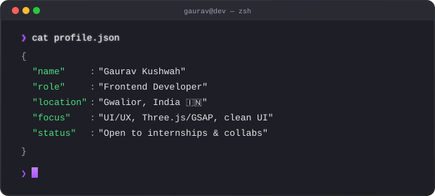
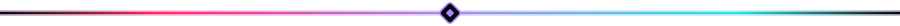
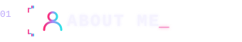
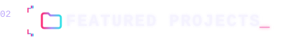
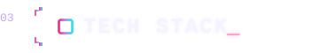
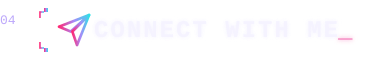

<div align="center">

  <!-- HEADER -->
  

  <br/>

  <a href="https://github.com/gauravkushwah8518-rgb">
    
  </a>
  &nbsp;
  <a href="https://github.com/gauravkushwah8518-rgb?tab=repositories">
    
  </a>
  &nbsp;
  <a href="https://github.com/gauravkushwah8518-rgb?tab=repositories&stargazers=true">
    
  </a>
  &nbsp;
  <a href="https://github.com/gauravkushwah8518-rgb?tab=followers">
    
  </a>

  <br/><br/>

  

  <br/><br/>

  <!-- QUICK NAV -->
  <a href="#-about-me"></a>
  &nbsp;
  <a href="#-featured-projects"></a>
  &nbsp;
  <a href="#-tech-stack"></a>
  &nbsp;
  <a href="#-connect-with-me"></a>

</div>

<br/>

<br/>

<!-- ABOUT -->
<a id="-about-me"></a>


<br/>

<table>
<tr>
<td width="55%" valign="top">

```yaml
name: Gaurav Kushwah
located_in: Gwalior, Madhya Pradesh, India 🇮🇳
github: gauravkushwah8518-rgb

socials:
  instagram: gaurav_ig__k
  x: Gauravkush9179

areas_of_focus:
  - 🎨 UI/UX-driven frontend development
  - 🌌 Cinematic 3D web experiences (Three.js/GSAP)
  - ♿ Accessibility-first tooling

currently_building:
  - AccessEase — universal accessibility toolkit
  - GAURAV.OS — cinematic 3D dev portfolio
  - StudyOS — AI-powered learning platform

currently_learning:
  - TypeScript deep-dive & backend fundamentals

life_philosophy: "Design it dark, animate it smooth, ship it real."
```

</td>
<td width="45%" valign="top">

**🔭 Currently**
- 🛠️ Building: AccessEase as an embeddable widget
- 🌱 Learning: TypeScript + backend fundamentals
- 🟢 Status: open to collaborations & freelance

**🎯 2026 Focus**
- Ship AccessEase as a public, embeddable widget
- Polish GAURAV.OS into a full guided walkthrough
- Level up TypeScript + backend fundamentals

**💡 Design Approach**
- Dark UI with glassmorphism & neon accents
- Purple / cyan / pink signature palette
- Motion-first, scroll-driven interfaces
- Vanilla JS craftsmanship where it counts

**⚡ Fun Facts**
- Self-hosted tinkerer & terminal aesthetic addict
- Believes every pixel deserves a purpose
- Debugs with lo-fi music on loop

</td>
</tr>
</table>

<br/>

<div align="center">
  <em>“Design it dark, animate it smooth, ship it real.”</em> — <strong>Gaurav Kushwah</strong>
</div>

<br/>

<br/>

<!-- PROJECTS -->
<a id="-featured-projects"></a>


<br/>

<!-- TODO: add repo + live demo badge links for the remaining projects once their repos are public -->

<table>
<tr>
<td width="50%" valign="top">

### [🧩 AccessEase](https://github.com/gauravkushwah8518-rgb/Accessease)
Universal accessibility toolkit — dyslexia mode, text-to-speech, voice commands, color-blind filters, reading ruler, and an embeddable widget script.

`Vanilla JS` `Web APIs` `A11y`

<a href="https://github.com/gauravkushwah8518-rgb/Accessease" target="_blank"></a>
&nbsp;
<a href="https://accessease.netlify.app/" target="_blank"></a>

### 🤖 GAURAV.OS
A cinematic, first-person 3D developer portfolio — a walkthrough corridor with doors to each section, guided by a robot assistant (G-BOT) with its own terminal.

`Three.js` `GSAP` `Lenis`

### 📝 MARKDOWN-X
A markdown writing studio — live preview, document management, export to `.md`/`.html`. Futuristic dark SaaS aesthetic.

`HTML` `CSS` `JavaScript`

</td>
<td width="50%" valign="top">

### 🪐 My Digital Universe
A desk/workspace-themed 3D portfolio built with React Three Fiber.

`React Three Fiber` `3D`

### 🧠 Nexora
"Everything You Need. One Smart Space." — an all-in-one personal command center: dashboard, tasks, notes, goals, AI assistant, wrapped in a glassmorphism cyberpunk UI.

`React` `Glassmorphism`

### 📚 StudyOS
An AI-powered learning platform with an AI tutor, quizzes, flashcards, notes, and study planning.

`React 19` `Vite` `Express` `Gemini API`

</td>
</tr>
</table>

<br/>

<br/>

<!-- TECH STACK -->
<a id="-tech-stack"></a>


<br/><br/>

<div align="center">

  **Languages & Core**
  <br/>
  
  
  
  

  <br/><br/>

</div>

<br/>

<br/>

<!-- CONNECT -->
<a id="-connect-with-me"></a>


<br/>

<div align="center">

**Open to collaborations, freelance work & open-source contributions.**<br/>
Building something interesting? My inbox is always open.

<br/>

<a href="https://github.com/gauravkushwah8518-rgb" target="_blank">
  
</a>
&nbsp;
<a href="mailto:gauravkushwah8518@gmail.com" target="_blank">
  
</a>
&nbsp;
<a href="https://www.instagram.com/gaurav_ig__k/" target="_blank">
  
</a>
&nbsp;
<a href="https://x.com/Gauravkush9179" target="_blank">
  
</a>

</div>

<br/>

<div align="center">
  
  <br/>
  
</div>
